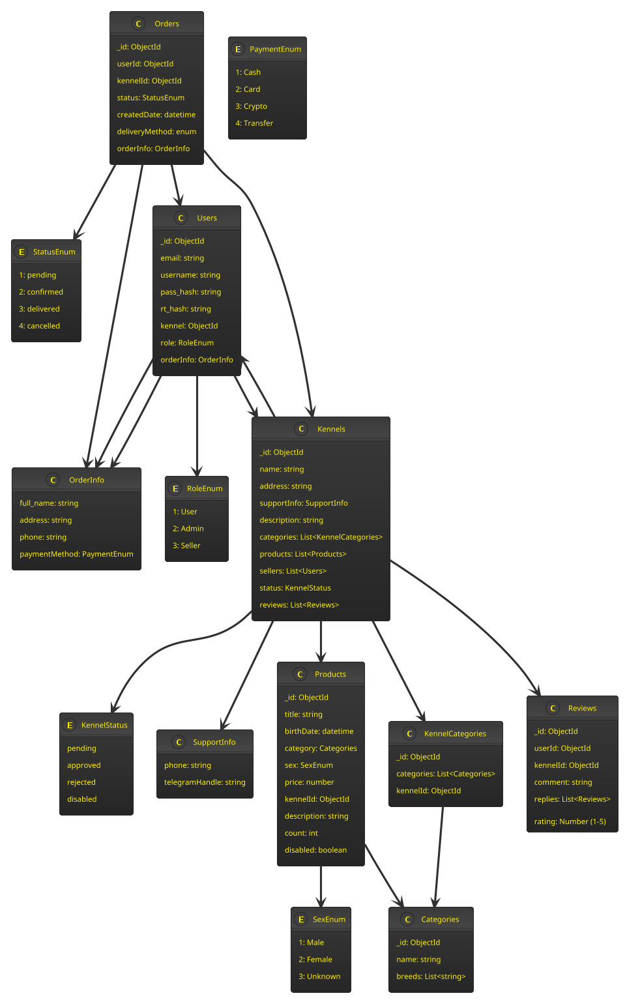

### Схема базы данных

```plantuml
@startuml

!theme black-knight

enum RoleEnum {
  1: User
  2: Admin
  3: Seller
}

enum PaymentEnum {
  1: Cash
  2: Card
  3: Crypto
  4: Transfer
}

enum KennelStatus {
  pending
  approved
  rejected
  disabled
}

enum SexEnum {
  1: Male
  2: Female
  3: Unknown
}

enum StatusEnum {
  1: pending
  2: confirmed
  3: delivered
  4: cancelled
}

class Users {
  _id: ObjectId
  email: string
  username: string
  pass_hash: string
  rt_hash: string
  kennel: ObjectId
  role: RoleEnum
  orderInfo: OrderInfo
}

class OrderInfo {
  full_name: string
  address: string
  phone: string
  paymentMethod: PaymentEnum
}

class Kennels {
  _id: ObjectId
  name: string
  address: string
  supportInfo: SupportInfo
  description: string
  categories: List<KennelCategories>
  products: List<Products>
  sellers: List<Users>
  status: KennelStatus
  reviews: List<Reviews>
}

class SupportInfo {
  phone: string
  telegramHandle: string
}

class Products {
  _id: ObjectId
  title: string
  birthDate: datetime
  category: Categories
  sex: SexEnum
  price: number
  kennelId: ObjectId
  description: string
  count: int
  disabled: boolean
}

class Orders {
  _id: ObjectId
  userId: ObjectId
  kennelId: ObjectId
  status: StatusEnum
  createdDate: datetime
  deliveryMethod: enum
  orderInfo: OrderInfo
}

class KennelCategories {
  _id: ObjectId
  categories: List<Categories>
  kennelId: ObjectId
}

class Categories {
  _id: ObjectId
  name: string
  breeds: List<string>
}

class Reviews {
  _id: ObjectId
  userId: ObjectId
  kennelId: ObjectId
  rating: Number (1–5)
  comment: string
  replies: List<Reviews>
}

Users --> OrderInfo
Users --> Kennels
Users --> RoleEnum
Users --> OrderInfo
Kennels --> SupportInfo
Kennels --> KennelCategories
Kennels --> Products
Kennels --> Users
Kennels --> Reviews
Kennels --> KennelStatus
Products --> Categories
Products --> SexEnum
Orders --> Users
Orders --> Kennels
Orders --> StatusEnum
Orders --> OrderInfo
KennelCategories --> Categories

@enduml

```
